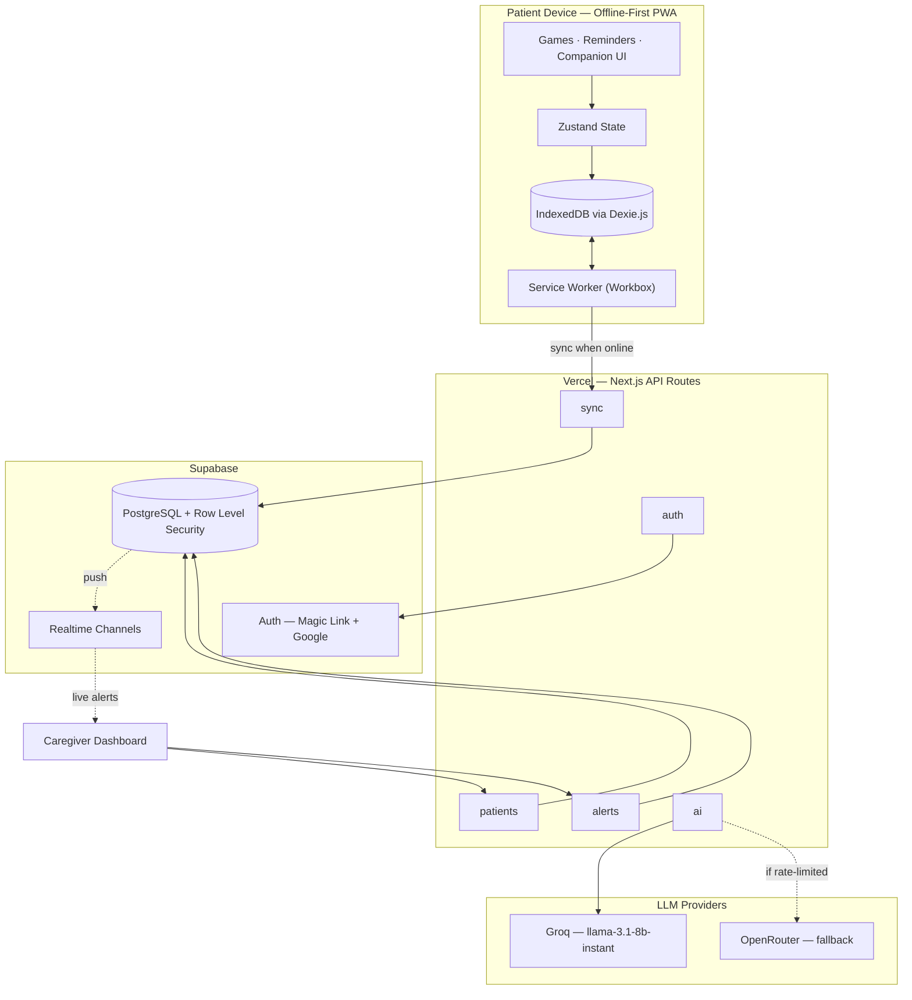
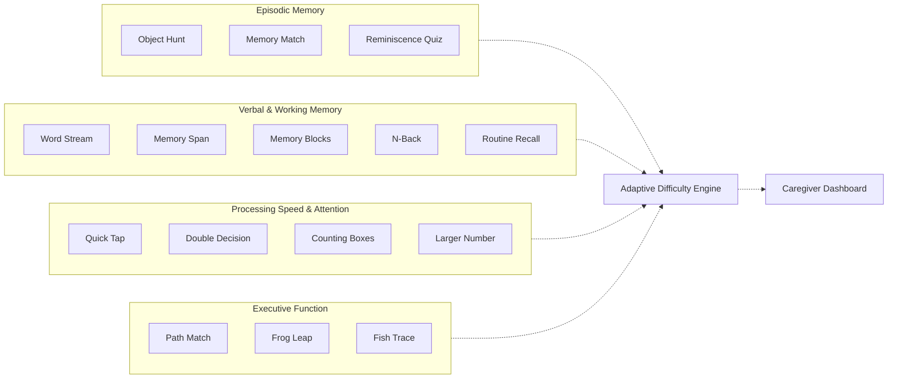
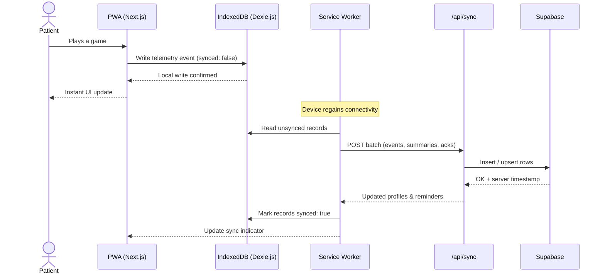
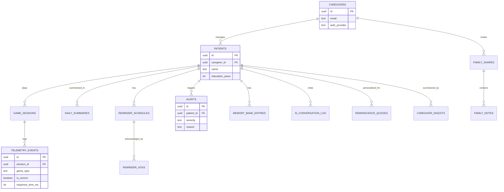

<a name="top"></a>
<p align="center">
  
</p>

<h1 align="center">SMRITI</h1>
<p align="center">
  <b>Smart Memory & Reminder Intervention for Therapeutic Independence</b>
</p>
<p align="center">
  Offline-first cognitive care for elderly dementia patients in India's North Eastern Region —
  <br />
  clinically-grounded games, daily reminders, and a live caregiver dashboard, in the patient's own language.
</p>

<p align="center">
  
  
  
  
  
  
  
  
</p>

<p align="center">
  Built for <b>SIH26003</b> (Smart India Hackathon) · Issued by <b>MDoNER</b> · Clinical guidance from <b>LGBRIMH Tezpur</b> + <b>ARDSI Guwahati</b>
</p>

<p align="center">
  
  
  
  
</p>

---

<p align="center">
  
</p>

### Contents

[Overview](#overview) · [Why SMRITI](#why-smriti) · [Features](#features) · [Architecture](#architecture) · [Cognitive Game Suite](#cognitive-game-suite) · [Offline-First Sync](#offline-first-sync) · [Data Model](#data-model) · [Tech Stack](#tech-stack) · [Project Structure](#project-structure) · [Getting Started](#getting-started) · [Environment Variables](#environment-variables) · [Testing](#testing) · [Documentation](#documentation) · [Roadmap](#roadmap) · [Contributing](#contributing) · [Disclaimer](#disclaimer) · [License](#license) · [Acknowledgments](#acknowledgments)

---

## Overview

**SMRITI** is an offline-first Progressive Web App that turns a caregiver's phone into a cognitive-care kit for an elderly relative living with dementia or mild cognitive impairment (MCI). One device, two modes:

- **Patient Mode** — audio-first cognitive games, daily medication/hydration/activity reminders, and an AI companion, usable by someone who has never touched a smartphone.
- **Caregiver Mode** — a dashboard that turns gameplay into a traffic-light health signal, tracks reminder adherence, flags sudden cognitive decline, and keeps family notified — all without requiring the patient to be online, literate, or fluent in English.

Everything works with the screen off the internet. When connectivity returns, it syncs silently in the background.

## Why SMRITI

| | SMRITI | BrainHQ / Lumosity |
|---|---|---|
| Works fully offline | Yes | No — online-dependent |
| Assamese / Hindi audio-first UI | Yes | No — English-only |
| Designed for caregiver-mediated sessions | Yes | No — solo play |
| Games mapped to validated clinical assessments (CANTAB, MoCA, TMT) | Yes | Partial |
| Built for low-literacy, low-vision rural users | Yes | No — Western-normed UX |
| Monthly running cost | **$0** (free tiers) | Subscription |

> [!NOTE]
> Supervised, computerized cognitive training shows **Hedges' g = 0.57** on global cognition in MCI (2025 meta-analysis, 19 RCTs) — and **triples in effect** when caregiver-supervised rather than solo. SMRITI is built around that finding, not around solo play.

## Features

<table>
<tr>
<td valign="top" width="50%">

**Patient Mode** *(on caregiver's device)*
- 15 cognitive games spanning 4 clinical domains
- Adaptive, ML-assisted difficulty per patient
- Audio-first — no reading required
- 100% playable offline
- NER-cultural imagery (gamosa, one-horned rhino, bamboo baskets, dhol)
- "Ask Smriti" AI companion for conversation & reassurance
- Personalized reminiscence quizzes from real family photos

</td>
<td valign="top" width="50%">

**Caregiver Dashboard**
- Traffic-light triage (red/yellow/green) across all patients
- Longitudinal cognitive graphs (30/90/180 day)
- Reminder adherence tracking
- Sudden cognitive drop detection (>2 SD threshold)
- Family notes & shared updates
- AI-generated caregiver digests
- Google / magic-link authentication, Supabase RLS per caregiver

</td>
</tr>
</table>

## Architecture



Patient-side state never depends on the network: every game write lands in IndexedDB first, and the UI reacts to that local write immediately. The service worker is the only thing that talks to the server.

## Cognitive Game Suite

Every game maps to a validated neuropsychological assessment — this isn't a generic brain-training app with a dementia label stapled on.

| Game | Clinical basis | What it measures |
|---|---|---|
| **Object Hunt** *(Kotha Khoj)* | CANTAB Paired Associates Learning | Episodic memory — 81% accuracy classifying normal/MCI/Alzheimer's |
| **Word Stream** *(Xobdo Xuwori)* | MoCA Delayed Recall | Verbal memory — 90% sensitivity for MCI detection |
| **Quick Tap** *(Beg Beg)* | CANTAB Rapid Visual Processing + BrainHQ Double Decision | Processing speed & inhibitory control |
| **Path Match** *(Baat Milao)* | Trail Making Test | Executive function & visual scanning |

Plus 11 more games extending the same four domains — Memory Match, Memory Span, Memory Blocks, N-Back, Routine Recall (memory & recall); Double Decision, Counting Boxes, Larger Number (speed & attention); Frog Leap, Fish Trace (executive function); Reminiscence Quiz (personal, photo-based recall).



### The games

<p align="center">
  &nbsp;&nbsp;
  &nbsp;&nbsp;
  &nbsp;&nbsp;
  &nbsp;&nbsp;
  &nbsp;&nbsp;
  &nbsp;&nbsp;
  
  <br /><br />
  &nbsp;&nbsp;
  &nbsp;&nbsp;
  &nbsp;&nbsp;
  &nbsp;&nbsp;
  &nbsp;&nbsp;
  &nbsp;&nbsp;
  &nbsp;&nbsp;
  
</p>
<p align="center"><sub>Object Hunt · Word Stream · Quick Tap · Path Match · Memory Match · Memory Span · Memory Blocks · N-Back · Double Decision · Counting Boxes · Larger Number · Frog Leap · Fish Trace · Family &amp; Life Quiz · Routine Recall</sub></p>

### Reminder icons

<p align="center">
  &nbsp;&nbsp;
  &nbsp;&nbsp;
  &nbsp;&nbsp;
  
</p>
<p align="center"><sub>Medication · Hydration · Activity · Appointment</sub></p>

### Interface icons

<p align="center">
  &nbsp;&nbsp;
  &nbsp;&nbsp;
  &nbsp;&nbsp;
  &nbsp;&nbsp;
  
</p>
<p align="center"><sub>Ask Smriti · Caregiver access · Family message · Seen / done · Could not connect</sub></p>

## Offline-First Sync



| Data type | Conflict strategy | Why |
|---|---|---|
| Telemetry events | Append-only | Events are immutable facts — no conflicts possible |
| Daily summaries | Server recomputes from events | Single source of truth |
| Patient profiles | Last-write-wins by `updatedAt` | Caregiver edits win |
| Reminder schedules | Last-write-wins by `updatedAt` | Caregiver is the authority |
| Game difficulty level | Local device is authoritative | Device holds the latest performance data |

## Data Model



Full schema, indexes, and Row Level Security policies live in [docs/03_DATABASE.md](smriti/docs/03_DATABASE.md).

## Tech Stack

| Layer | Technology |
|---|---|
| Framework | Next.js 16 (App Router), React 19, TypeScript |
| Styling | Tailwind CSS v4 |
| State | Zustand |
| Offline storage | Dexie.js (IndexedDB) |
| PWA / offline | `next-pwa` + Workbox service worker |
| Backend | Supabase — PostgreSQL, Auth, Realtime, Row Level Security |
| AI companion | Groq primary, OpenRouter fallback (model slugs change — see `src/lib/ai/llm-client.ts`) |
| Speech synthesis | Bhashini TTS (Assamese/Hindi/English), browser `speechSynthesis` fallback |
| Forms & validation | react-hook-form + zod |
| Charts | Recharts |
| Motion | Framer Motion |
| Audio | Howler.js |
| i18n | next-intl + locale JSON (English, Hindi, Assamese) |
| Testing | Vitest, Testing Library, fake-indexeddb |
| Accessibility typography | Atkinson Hyperlegible (low-vision optimized), Fraunces, Noto Sans Bengali/Devanagari |
| Deployment | Vercel + Supabase — **$0/month** on free tiers |

## Project Structure

<details>
<summary>Expand file tree</summary>

```text
smriti/
├── public/
│   ├── manifest.json         # PWA manifest
│   ├── icons/                # App icons (192, 512, apple-touch)
│   ├── images/                # Game icon set
│   └── audio/                 # Pre-recorded voice prompts (as/hi/en)
├── src/
│   ├── app/
│   │   ├── page.tsx            # Landing page
│   │   ├── app/                # Patient home / game selector
│   │   ├── games/               # 15 game routes
│   │   ├── reminders/           # Reminder flow
│   │   ├── companion/           # "Ask Smriti" AI companion
│   │   ├── login/                # Patient/device login
│   │   ├── caregiver/
│   │   │   ├── dashboard/         # Traffic-light triage
│   │   │   ├── patients/[id]/     # Patient detail + adherence
│   │   │   ├── memory-bank/       # Reminiscence content manager
│   │   │   ├── onboarding/        # New patient setup
│   │   │   └── login/             # Magic link + Google OAuth
│   │   └── api/
│   │       ├── sync/               # Offline → cloud sync
│   │       ├── patients/            # Patient CRUD + timeline
│   │       ├── alerts/               # Cognitive-drop detection
│   │       ├── family-share/          # Family invite + notes
│   │       ├── device-trust/           # Kiosk device trust tokens
│   │       └── ai/                      # Companion, digests, transcription
│   ├── components/
│   │   ├── ui/                 # Design-system primitives
│   │   ├── games/                # Per-game components
│   │   ├── patient/                # Patient-mode chrome
│   │   └── layout/                  # Nav, language picker
│   ├── lib/
│   │   ├── db/                # Dexie schema + sync engine
│   │   ├── engine/               # Difficulty, scoring, alerts
│   │   ├── ai/                     # LLM client (Groq/OpenRouter)
│   │   ├── audio/                    # Playback manager
│   │   ├── i18n/                       # Locales + provider
│   │   └── supabase/                    # Client factories, RLS-aware
│   ├── hooks/                  # useOfflineStatus, useSync, ...
│   └── stores/                  # Zustand stores
└── docs/                          # PRD, architecture, DB, game design, deployment
```

</details>

## Getting Started

> [!TIP]
> The app lives inside the `smriti/` subdirectory of this repo — don't forget the `cd`.

```bash
git clone https://github.com/prathameshfuke/smriti-backup.git
cd smriti-backup/smriti
npm install
cp .env.local.example .env.local
# fill in the keys below, then:
npm run dev
# open http://localhost:3000
```

Install as a PWA on mobile: **Add to Home Screen** (Android Chrome or iOS Safari).

| Script | Purpose |
|---|---|
| `npm run dev` | Start the dev server |
| `npm run build` | Production build |
| `npm start` | Serve the production build |
| `npm run lint` | ESLint |
| `npm test` | Run the Vitest suite once |
| `npm run test:watch` | Vitest in watch mode |
| `npm run test:ui` | Vitest browser UI |

## Environment Variables

| Variable | Required for | Notes |
|---|---|---|
| `NEXT_PUBLIC_SUPABASE_URL` | Sync, caregiver dashboard | Supabase project URL |
| `NEXT_PUBLIC_SUPABASE_ANON_KEY` | Sync, caregiver dashboard | Supabase anon/public key |
| `SUPABASE_SERVICE_ROLE_KEY` | Server-side kiosk/device-trust routes | **Never expose to the browser or commit it** |
| `GROQ_API_KEY` | AI companion (primary) | Free at [console.groq.com/keys](https://console.groq.com/keys) |
| `OPENROUTER_API_KEY` | AI companion (fallback) | Used if Groq is rate-limited/unavailable — free at [openrouter.ai/keys](https://openrouter.ai/keys) |
| `BHASHINI_USER_ID` / `BHASHINI_ULCA_API_KEY` | Assamese/Hindi speech-to-text and Assamese/Hindi/English text-to-speech (primary path) | ULCA credential pair from [Bhashini](https://bhashini.gov.in) — used for the config call in `src/lib/ai/bhashini-auth.ts`, which resolves the real service and mints the dynamic key the compute call sends |
| `BHASHINI_INFERENCE_API_KEY` | Legacy fallback for the case above | Kept alongside the pair above: live-probed, this ULCA account's discovery has no registered ASR service for Assamese at all, while this older static key is confirmed still working for it — `bhashini-asr-client.ts`/`bhashini-client.ts` fall back to it only when the primary discovery call fails |
| Google OAuth credentials | Caregiver "Sign in with Google" | See `src/app/api/auth/google/route.ts` |

> [!NOTE]
> Games and reminders work fully offline without any of these — only sync and the caregiver dashboard need them. All AI calls are routed through `src/lib/ai/llm-client.ts`; never call Groq/OpenRouter directly from a feature file.

## Testing

```bash
npm test
```

Vitest + Testing Library, with `fake-indexeddb` standing in for Dexie's IndexedDB backend so offline-storage logic is covered without a browser.

## Documentation

| Doc | Covers |
|---|---|
| [01_PRD.md](smriti/docs/01_PRD.md) | Product vision, features, success metrics |
| [02_ARCHITECTURE.md](smriti/docs/02_ARCHITECTURE.md) | System design, offline data flow |
| [03_DATABASE.md](smriti/docs/03_DATABASE.md) | Full schema, RLS policies, migrations |
| [04_GAME_DESIGN.md](smriti/docs/04_GAME_DESIGN.md) | Clinical specs, difficulty algorithms |
| [06_DEPLOYMENT.md](smriti/docs/06_DEPLOYMENT.md) | Deploying to Vercel + Supabase |
| [07_AGENT_PROMPTS.md](smriti/docs/07_AGENT_PROMPTS.md) | Build guide for AI pair-programming |
| [08_API_SPEC.md](smriti/docs/08_API_SPEC.md) | API route reference |
| [09_PITCH_GUIDE.md](smriti/docs/09_PITCH_GUIDE.md) | Hackathon presentation guide |

## Roadmap

- [x] **Phase 1 — Hackathon MVP:** core games, rule-based difficulty, Assamese/Hindi/English audio, reminders, caregiver dashboard, offline + sync, installable PWA
- [x] Shipped beyond original MVP scope: 15 games (vs. 4 planned), ML-assisted difficulty model, AI companion, family notes, caregiver digests, Google OAuth
- [x] Traffic-light triage dashboard
- [x] Bhashini TTS integration — companion answers + reminder narration, cached locally, browser-TTS fallback
- [ ] Bhashini ASR integration (needs browser recording switched from webm/Opus to wav/flac — Bhashini's ASR only documents those formats)
- [ ] Manipuri + Bodo language support
- [ ] Per-domain Elo rating with dynamic K-value
- [ ] ABHA health-record linkage exploration
- [ ] Pilot deployment with LGBRIMH Tezpur + ARDSI Guwahati (50 patients, IRB-approved protocol)
- [ ] Tele-MANAS referral pathway integration

## Contributing

Contributions are by invitation only. This repo is set up to be worked on alongside an AI coding agent — see [AGENTS.md](smriti/AGENTS.md) for the Next.js version notes agents should read before touching code, and [docs/07_AGENT_PROMPTS.md](smriti/docs/07_AGENT_PROMPTS.md) for the original build-prompt sequence.

## Disclaimer

> [!IMPORTANT]
> SMRITI supports cognitive **engagement**. It does not diagnose or treat any condition, and does not claim to prevent cognitive decline. Consult a healthcare professional for medical concerns.
>
> It does **not**: diagnose dementia · require internet connectivity · require digital literacy from patients · store PII or sensitive health data in the cloud.

## License

Proprietary. Copyright © 2026 SMRITI. All rights reserved.

No part of this software, its source code, or its documentation may be copied, modified, distributed, or used without prior written permission from the copyright holder.

## Acknowledgments

Built with clinical guidance from **LGBRIMH Tezpur** (nodal tertiary geriatric mental health center, NER) and community partnership with **ARDSI Guwahati** (Alzheimer's and Related Disorders Society of India).

Designed using evidence from **CANTAB**, **MoCA**, and 25+ peer-reviewed studies on computerized cognitive training in MCI. Language infrastructure via **Bhashini** (MeitY) and **Project ISHAAN** (AI4Bharat).

---

<p align="center">
  
  <br />
  <sub>Built for caregivers and ASHA workers, not wealthy urban users.</sub>
  <br />
  <a href="#top">back to top</a>
</p>
